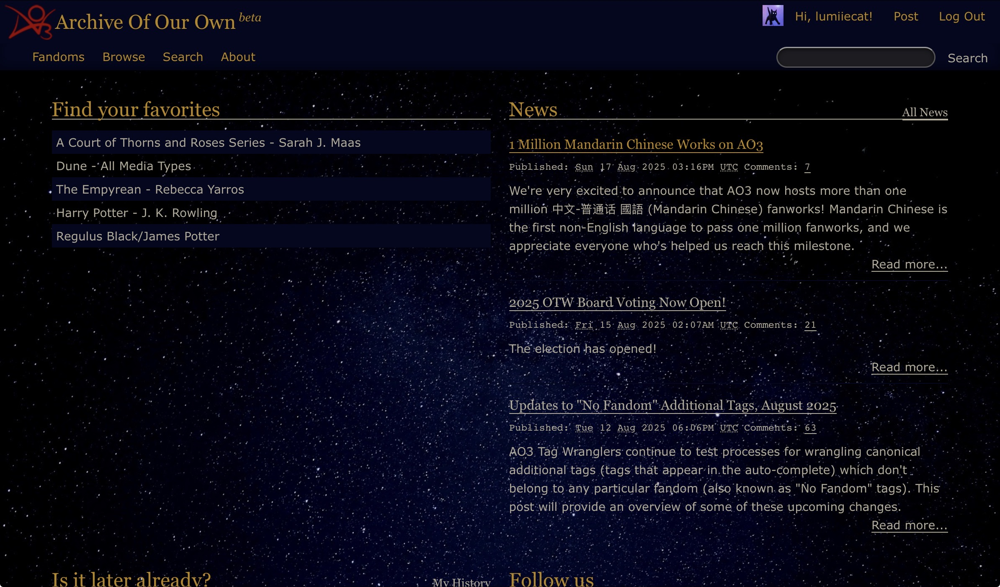
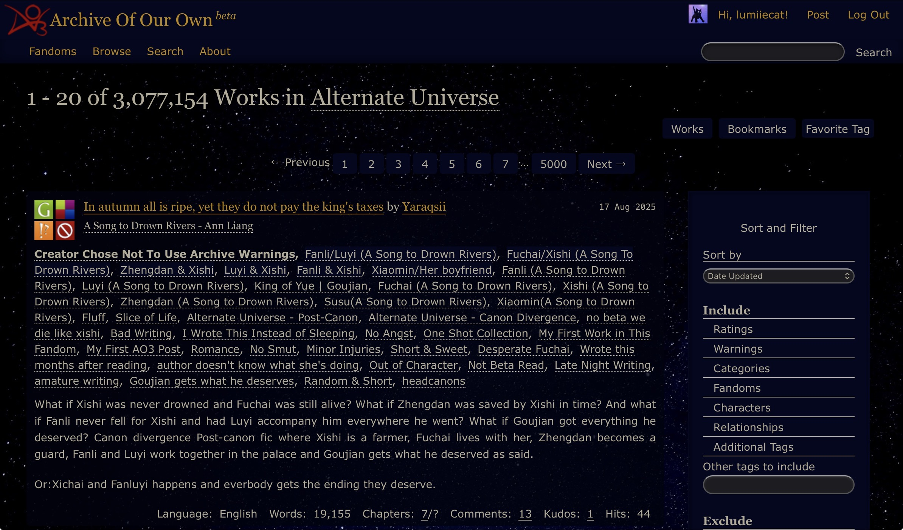
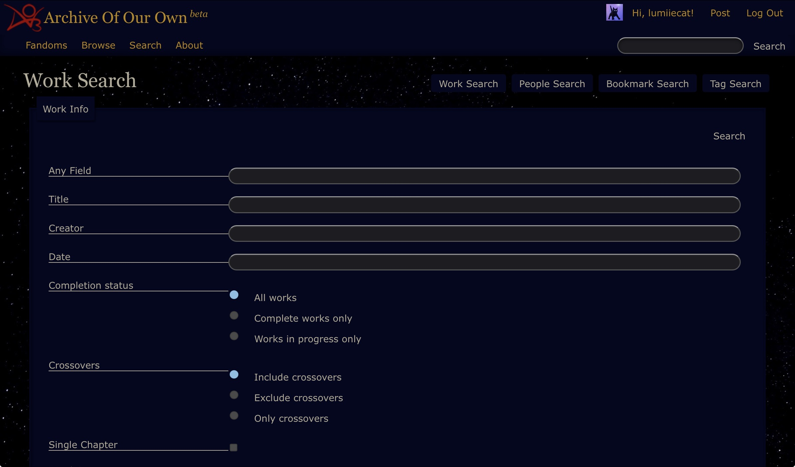
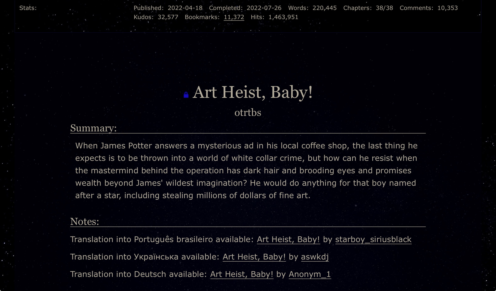

# Written In Starlight Ao3 Skin
An elegant, minimalist AO3 site skin with a dark starry night theme, warm gold accents, designed for midnight reading sessions. (works best on horizontal view on bigger screens, ipads, laptops, e.t.c)

I'm still updating and changing small details, make sure to check back if you're interested in future versions!

  
**!VERY VERY INCREDIBLY IMPORANT PLEASE READ!**
  
**This skin utilizes both "custom css" and "wizard", that means you need to input the correct colour hex codes/name in "wizard" for this skin to look as intended. Otherwise it will look butchered! Colour codes for wizard at the bottom of the page!**

# Skin Image Preview
 

 

 

# Aesthetic
* A deep starry night sky as the full-screen background, subtle, beautiful, and non-distracting.

* Elegant gold accents reminiscent of constellations.

* Soft yellow-tinted text that’s easy on the eyes, especially during late-night reading sessions.

* A clean, uncluttered reading experience, free from harsh contrasts and busy visuals.

* Faithful to AO3’s original design, no major structural UI changes.

# Features
* The little round "questionmark button" is removed. Most people dont need it anyways unless they're a new user. I thought it's good for yall to know just in case.

* Changed the look of the checkboxes to fit theme better (it looks so much better now)

* The searchboxes now have rounded corners :D

# Installation
Create an Ao3 site skin, go to "Write Custom CSS" and paste the code into the text field.

**!VERY VERY INCREDIBLY IMPORANT PLEASE READ!**

**This skin utilizes both "custom css" and "wizard", that means you need to input the correct colour hex codes/name in "wizard" for this skin to look as intended. Otherwise it will look butchered! Colour codes for wizard below!**

Colour hex code for "wizard"

background colour: #000000

text colour: #b3ab98

header colour: darkgoldenrod

accent colour: #03071F

